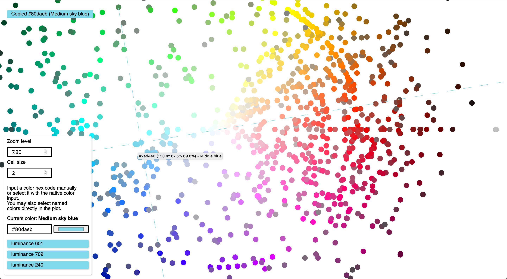

# Actual thing (index.html)




# Colors

## How to?

1. Go to [Wikipedia compact list of colors](https://en.wikipedia.org/wiki/List_of_colors_(compact)).
2. Open the dev console
3. Execute one of the following scripts
4. paste the copied result wherever makes you happy.

---

Execute this script to recover (copy) the named colors from the article.
This will copy an array of detailed objects.
Usefull for updating the file `colors.js` (used by `index.html`).

```js
copy('[' + Array.from(document.querySelector('.mw-parser-output').querySelectorAll('p + p')).map(el => {
  const _title = el.previousElementSibling.title
  const [h, s, l] = _title.slice(8).split(')')[0].replace('-', '0').replace('°', '').split(' ')
  return JSON.stringify({
    hex: _title.slice(-7).toLowerCase(),
    name: el.textContent,
    h: Number(h),
    s: Number(s.slice(0, -1)),
    l: Number(l.slice(0, -1)),
  })
}).join(',') + ']')
```

This copies a quick html representation. (This was the base for the current `index.html`)

```js
(function () {
  const elements = Array.from(document.querySelector('.mw-parser-output').querySelectorAll('p + p'))
  const toColorObject = element => {
    const _title = element.previousElementSibling.title
    const [h, s, l] = _title.slice(8).split(')')[0].replace('-', '0').replace('°', '').split(' ')
    return {
      hex: _title.slice(-7).toLowerCase(),
      name: element.textContent,
      h: Number(h),
      s: Number(s.slice(0, -1)),
      l: Number(l.slice(0, -1)),
    }
  }
  copy(
`<!DOCTYPE html>
<html>
<head><meta charset="UTF-8"></head>
<body>
  <textarea id="clipboard" style="position: fixed; top:0; left:0; opacity: 0;"></textarea>
  <div id="container" style="position: relative; width: 0; height: 0; margin: 50vh 50vw;"></div>
<script>
const colors = [${elements.map(toColorObject).map(JSON.stringify).join(',')}]
const clip = document.getElementById('clipboard')
const container = document.getElementById('container')
for (const c of colors) {
  const el = document.createElement('div')
  el.style = \`position: absolute; left: 0; top: 0; transform: translateX(\${c.s}) rotate(\${c.h}deg); width: 20px; height: 20px; cursor: pointer; background-color: \${c.hex}\`
  el.title = \`\${c.hex} - \${c.name}\`
  el.addEventListener('click', event => {
    clip.value = c.hex
    clip.focus()
    clip.select()
    document.execCommand('copy')
  })
  container.appendChild(el)
}
</script>
</body>
</html>
`
  )
})()
```
